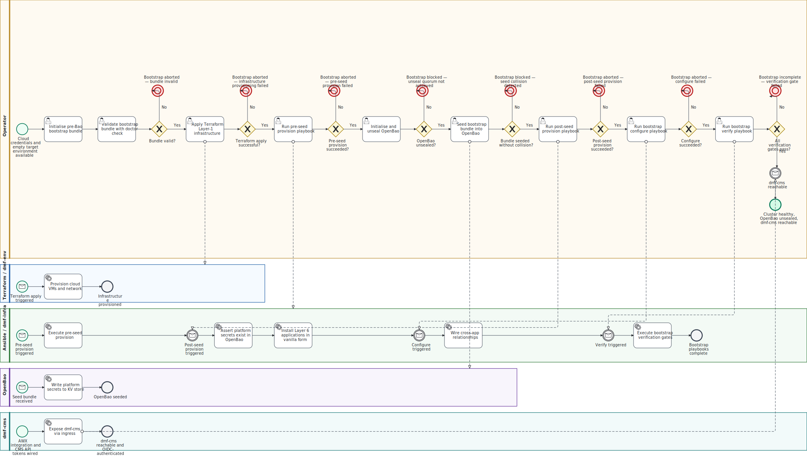

# DMF Platform Bootstrap Process

**Process ID:** `dmf-bootstrap`
**Version:** 1.0 (2026-05-09)
**Status:** Draft — intent model. See Assumptions section for gaps between this model and current implementation.
**Canonical source:** `diagrams/dmf-bootstrap.bpmn`. Rendered diagram is derived from the BPMN source.
**Notation:** BPMN 2.0 (ISO/IEC 19510)

---

## Diagram

---

## 1. Purpose

Define the canonical, authoritative sequence for bootstrapping a fresh DMF cluster
from "operator has cloud credentials and an empty target environment" to "cluster
is healthy, OpenBao is unsealed, and dmf-cms is reachable."

This process model is the *intent* representation. It captures what bootstrap should
look like when the implementation plan (revision 5 of
`docs/plans/DMF Bootstrap Provision Configure Split Plan 2026-05-07.md`) is complete.
Where the current implementation diverges from this intent, the deviation is noted in
the Assumptions section, not modelled as a workaround.

---

## 2. Scope

**In scope:**
- Operator actions from credential possession through cluster ready state
- Layer-1 infrastructure provisioning via Terraform
- Pre-seed Ansible provision: host platform, container platform, OpenBao, ESO
- Manual OpenBao initialisation and unseal
- Pre-Bao bootstrap bundle seeding into OpenBao
- Post-seed Ansible provision: monitoring base and Layer 6 applications in vanilla form
- Bootstrap Configure: cross-app wiring (Authentik OIDC graph, NetBox SoT, Forgejo, AWX, dmf-cms)
- Bootstrap Verify: readiness gates

**Out of scope:**
- Day-2 operations (routine OpenBao unseal, playbook re-runs on running clusters)
- Media workload lifecycle (catalog Provision, Configure, Finalise — see `dmf-runbooks` and ADR-0012)
- OpenBao disaster-recovery re-key procedure
- Shamir share distribution ceremony (covered by `dmf-openbao-unseal` skill and ADR-0009)
- dmf-cms build and release pipeline

---

## 3. Actors / Roles

| Actor | BPMN Pool | Type |
|---|---|---|
| **Operator** | Operator | Human. Holds cloud credentials, age private key, Shamir shares. Drives every phase transition. |
| **Terraform / dmf-env** | Terraform / dmf-env | Automated. OpenTofu provisions cloud VMs via `dmf-env/bin/tf-apply.sh`. |
| **Ansible / dmf-infra** | Ansible / dmf-infra | Automated. `dmf-env/bin/run-playbook.sh` executes `dmf-infra/k3s-lab-bootstrap/` playbooks against target nodes. |
| **OpenBao** | OpenBao | Automated. Receives the seeded bootstrap bundle; becomes steady-state secrets store. |
| **dmf-cms** | dmf-cms | Automated. Exposed via ingress during post-seed provision; OIDC-wired during configure. |

Note: AWX is installed as a Layer 6 application during post-seed provision and wired during
configure, but it does not drive any part of the bootstrap procedure itself. It becomes
relevant for media workload lifecycle after bootstrap is complete.

---

## 4. Trigger Event

**Trigger:** Operator possesses valid cloud credentials (Hetzner token, Cloudflare DNS token,
Tailscale/Headscale auth key) and the target environment has no existing DMF cluster.

The process begins with the operator running `dmf-env/bin/bootstrap-secrets.sh init <env>`.

---

## 5. Normal Path

The bootstrap follows seven sequential phases. Each phase must complete before the next
begins. There is a mandatory local seed boundary between Phase 3 (pre-seed provision)
and Phase 5 (post-seed provision): OpenBao must be initialised, unsealed, and seeded
with the bootstrap bundle before any Layer 6 application is installed.

### Phase 0 — Initialise and validate pre-Bao bootstrap bundle

1. Operator runs `bootstrap-secrets.sh init <env>`.
   - Collects provider tokens (Hetzner, Cloudflare, Tailscale) from operator-local config files.
   - Generates the k3s token (once; stable across reruns).
   - Generates or accepts the shared bootstrap admin identity
     (`vault_bootstrap_admin_username`, `vault_bootstrap_admin_email`,
     `vault_bootstrap_admin_password`).
   - Encrypts the bundle to `${DMF_BOOTSTRAP_BUNDLE_DIR}/<env>.sops.yaml` using SOPS + age.
     This file lives **outside any git tree** (see ADR-0011, Pre-Bao Secrets Design §1).
2. Operator runs `bootstrap-secrets.sh doctor <env>` to verify the bundle decrypts and
   all required fields are present.

### Phase 1 — Provision cloud infrastructure

3. Operator runs `dmf-env/bin/tf-apply.sh <env>`.
   - Provisions Hetzner CAX21 ARM64 nodes in the `nbg1` region.
   - cloud-init injects: operator pubkey and AWX control-node pubkey (ADR-0016).
   - Outputs: control node IP, worker node IPs, load-balancer IP.

### Phase 2 — Pre-seed Ansible provision

4. Operator runs `run-playbook.sh <env> bootstrap-provision-pre-seed.yml`.
   - Host platform: `200-baseline.yml`, `210-harden.yml`, kernel CVE mitigations.
   - Container platform: k3s cluster, `301-k3s-verify.yml` readiness gate,
     public + private ingress, cert-manager, Tailscale, Longhorn.
   - Registry: Zot with htpasswd authentication only (no OIDC at this stage).
   - Security base: `100-openbao.yml` (install, init config, policy bootstrap),
     `vertical-orchestration/100-eso.yml` (ESO + ClusterSecretStore), network policies.
   - **No Layer 6 application installs.** No `app-admin-facts` calls run in this phase.

### Phase 3 — Manual OpenBao initialisation and unseal

5. Operator SSHs to the control node and runs `bao operator init`.
   - 5 Shamir shares distributed across 5 locations per ADR-0009.
   - Automation file written to operator's secure JuiceFS mount for routine unseal.
6. Operator runs `dmf-env/bin/unseal-openbao.sh` (using shares 1 + 2 + 3).
   - OpenBao is now initialised, unsealed, and policy-ready.

### Phase 4 — Seed bootstrap bundle into OpenBao

7. Operator runs `bootstrap-secrets.sh seed-bao <env>`.
   - Decrypts the bundle using the age key.
   - Writes platform secrets to OpenBao via SSH to control node (ADR-0007 compliant —
     secrets transported through stdin, never in argv or environment).
   - Paths written: `secret/platform/bootstrap_admin`, `secret/platform/k3s/cluster`,
     `secret/platform/hetzner`, `secret/platform/cloudflare`, `secret/platform/tailscale`,
     `secret/platform/notifications`.
   - App-local compatibility copies written at `secret/apps/<app>/admin` with values
     identical to `secret/platform/bootstrap_admin`.
   - Collision policy: missing path → write; same value → no-op;
     differing platform path → fail (requires explicit `rotate`).

### Phase 5 — Post-seed Ansible provision

8. Operator runs `run-playbook.sh <env> bootstrap-provision-post-seed.yml`.
   - Playbook asserts `secret/platform/bootstrap_admin` and `secret/platform/k3s/cluster`
     exist in OpenBao before proceeding (safety guard for the seed boundary).
   - Monitoring base: Prometheus, Loki, Promtail, Grafana (minimal form).
   - Layer 6 vanilla app installs: landing page, Authentik, NetBox, Forgejo, AWX, DMF Console.
   - All apps receive the shared bootstrap admin identity from OpenBao.
   - No cross-app wiring at this stage (that happens in Phase 6).

### Phase 6 — Bootstrap Configure

> **2026-05-19 pending change — transport moving in-cluster.** This phase
> currently runs `bootstrap-configure.yml` via SSH-to-control-node (ADR-0010
> entry point + ADR-0016 Path A). The
> [DMF Cluster-Internal Ansible Execution and Catalog Helm Pivot Plan 2026-05-19](../plans/DMF%20Cluster-Internal%20Ansible%20Execution%20and%20Catalog%20Helm%20Pivot%20Plan%202026-05-19.md)
> Lane C migrates the 69x chain to an in-cluster runner pod (ADR-0025).
> When Lane C ships, this section is updated to "operator runs the same
> entry point; transport dispatches to in-cluster runner pod for 69x
> playbooks." The operator-facing command is unchanged.
> Phase 6's *content* (what gets wired) is unchanged either way.
> Also: a **new Phase 5a — Seed Zot** (per the 2026-05-19 plan's Stage 4b)
> will appear between Phase 5 (cluster up) and Phase 6 — pushes AWX EE
> image, NMOS-cpp images, and Helm charts into cluster-internal Zot before
> any downstream consumer comes up.

9. Operator runs `run-playbook.sh <env> bootstrap-configure.yml`.
   - Authentik facility identity graph: groups, passkey/bootstrap flow objects,
     shared operator identity, OIDC providers and application objects for all apps.
   - App identity overlays: Zot OIDC, Grafana OIDC, NetBox OIDC, Forgejo OIDC,
     AWX SAML/OIDC, DMF Console OIDC.
   - Source-of-truth and automation wiring: NetBox service users and tokens,
     Forgejo service user and repos, AWX SCM projects and job templates,
     AWX Machine credential (reads `secret/apps/awx/control_node_ssh` per ADR-0016 — still used for 693-class infra plays after Lane C lands),
     born-inventory registration.
   - CMS API token wiring: Authentik, AWX, NetBox, Forgejo tokens for dmf-cms.
   - **Does not launch media workloads.** Catalog launchers (`media-*` JTs)
     run later via AWX in an in-cluster EE pod per
     [ADR-0025](../decisions/0025-ansible-in-cluster-pods-and-catalog-helm.md).

### Phase 7 — Bootstrap Verify

10. Operator runs `run-playbook.sh <env> bootstrap-verify.yml`.
    - k3s nodes Ready; CoreDNS functional.
    - Public and private Traefik reachable per configured ingress lane.
    - cert-manager wildcard certificate Ready.
    - Longhorn StorageClass default and usable.
    - Zot `/v2/` authentication correct.
    - OpenBao initialised, unsealed, reachable.
    - ESO `ClusterSecretStore` Ready.
    - Authentik break-glass login path works.
    - Prometheus, Loki, Grafana, Promtail deployed.
    - App-local admin credentials match shared bootstrap admin identity.
    - OIDC operator identity has admin/superadmin access in every configured app.

11. dmf-cms confirms reachable via ingress (signal received by the Operator process end).

---

## 6. Exception Paths

| Exception | Point in process | Termination |
|---|---|---|
| Bundle invalid (missing fields, age decrypt failure) | Phase 0 — doctor check | Process terminates. Operator must fix bundle and restart from `init`. |
| Terraform apply fails (partial or full) | Phase 1 | Process terminates. Operator must inspect Terraform state, resolve drift, and re-apply. No Ansible has run; partial VM state may require `tofu destroy` and retry. |
| Pre-seed provision fails | Phase 2 | Process terminates. Operator must inspect Ansible output. Playbook is idempotent; rerunning after fixing the root cause is the expected recovery. |
| Unseal quorum not achieved | Phase 3 | Process terminates (blocked). Operator must locate a sufficient quorum of Shamir shares (3 of 5). See `dmf-openbao-unseal` skill and ADR-0009. |
| Seed collision detected | Phase 4 — seed-bao | Process terminates. A differing platform-path value exists in OpenBao (indicates a prior partial bootstrap). Operator must run `bootstrap-secrets.sh rotate <env>` or resolve manually. |
| Post-seed provision fails | Phase 5 | Process terminates. Playbook is idempotent; rerunning after fixing the root cause is the expected recovery. The assert gate prevents accidental overwrite of OpenBao paths. |
| Configure fails | Phase 6 | Process terminates. Typical causes: app not ready yet (retry after pod stabilises), OIDC client misconfiguration. Playbook is idempotent. |
| Verification gate fails | Phase 7 | Process terminates. Operator must diagnose the failing gate and re-run the specific sub-check or the full verify playbook. |

---

## 7. Inputs

| Input | Source | Notes |
|---|---|---|
| Cloud provider API token (Hetzner) | Operator-local `~/.config/hcloud/cli.toml` | Imported by `bootstrap-secrets.sh init` |
| Cloudflare DNS API token | Operator-local `~/.config/cf/dns.txt` | Imported by `bootstrap-secrets.sh init` |
| Tailscale / Headscale auth key | Operator-local `~/.config/ts/authkey.txt` | Imported by `bootstrap-secrets.sh init` |
| Alertmanager / Healthchecks notification URLs | Operator input or local files | Imported by `bootstrap-secrets.sh init` |
| age private key | Operator macOS Keychain | Required for bundle decryption |
| OpenBao Shamir shares (1+2+3) | JuiceFS + macOS Keychain | Required for Phase 3 unseal |
| AWX control-node SSH private key | Dedicated operator-bootstrap source | Seeded separately to `secret/apps/awx/control_node_ssh` per ADR-0016 |
| dmf-env inventory for target environment | `dmf-env/inventories/<env>/` | Must exist before Phase 1 |

---

## 8. Outputs

| Output | Location |
|---|---|
| Provisioned cloud VMs with cloud-init applied | Hetzner cloud, nbg1 region |
| Running k3s cluster (3-node Hetzner CAX21 ARM64) | Target environment |
| Initialised and unsealed OpenBao, seeded with bootstrap secrets | `openbao` namespace in cluster |
| ESO `ClusterSecretStore` connected to OpenBao | `external-secrets` namespace in cluster |
| Monitoring stack (Prometheus, Loki, Grafana, Promtail) | `monitoring` namespace in cluster |
| Layer 6 applications (Authentik, NetBox, Forgejo, AWX, DMF Console) | Their respective namespaces, OIDC-wired |
| AWX job templates for media workload catalog (nmos-cpp and peers) | AWX, ready to launch |
| Born-inventory registration in NetBox | NetBox, `lifecycle:active` |
| Encrypted pre-Bao bootstrap bundle (durable recovery artifact) | `${DMF_BOOTSTRAP_BUNDLE_DIR}/<env>.sops.yaml`, outside any git tree |

---

## 9. Systems Touched

| System | Phase(s) | Modification |
|---|---|---|
| Hetzner Cloud API | 1 | VMs, networks, load balancer created |
| Target nodes (SSH) | 2, 3, 4, 5, 6, 7 | OS hardened, k3s installed, Kubernetes workloads deployed |
| OpenBao | 3, 4 | Initialised; platform and app-local secrets written |
| ESO / Kubernetes Secrets | 5, 6 | `ExternalSecret` resources sync OpenBao paths to k8s Secrets |
| Authentik | 5, 6 | Base install; OIDC graph wired |
| NetBox | 5, 6 | Base install; SoT data, service users, born-inventory |
| Forgejo | 5, 6 | Base install; service user, automation repos |
| AWX | 5, 6 | Base install; SCM projects, job templates, Machine credential |
| DMF Console (dmf-cms) | 5, 6 | Base install; OIDC client configured |
| Cloudflare DNS | 1 | cert-manager DNS01 challenge record written |
| Tailscale / Headscale | 2 | Node auth key consumed; node enrolled |

---

## 10. Controls / Approvals

| Control | Where enforced | ADR |
|---|---|---|
| Bundle must be outside any git tree | `bootstrap-secrets.sh` refuses if bundle directory is inside a git working tree | ADR-0011 |
| Secrets never in argv, environment, or logs | `bootstrap-secrets.sh` uses stdin transport exclusively for all secret values | ADR-0007 |
| All Ansible runs through sanctioned entry point | `run-playbook.sh <env>` is the only path; direct `ansible-playbook` reserved for `--syntax-check` and `--list-tasks` | ADR-0010 |
| Post-seed assertion gate | `bootstrap-provision-post-seed.yml` asserts `secret/platform/bootstrap_admin` and `secret/platform/k3s/cluster` exist before any Layer 6 install | Implementation plan §4 |
| Seed collision policy | `seed-bao` fails (does not silently overwrite) on any differing platform-path value | Pre-Bao Secrets Design §4 |
| AWX SSH private key outside tracked code | Private key lives in OpenBao at `secret/apps/awx/control_node_ssh`; public key in Terraform variable only | ADR-0016 |
| Pre-commit gitleaks hook | Blocks commits containing PEM markers, known secret patterns | `.githooks/pre-commit` |
| No media workloads launched during bootstrap | `bootstrap-configure.yml` may create AWX job templates but must not run them | ADR-0012 |

---

## 11. Related Runbooks and Procedures

| Document | Purpose |
|---|---|
| `dmf-openbao-unseal` skill | Step-by-step unseal from 3-of-5 Shamir shares |
| `dmf-cluster-access` skill | Authoritative cluster access procedure; required before any live kubectl or playbook run |
| `docs/plans/DMF Bootstrap Provision Configure Split Plan 2026-05-07.md` | Implementation plan (rev 5) — lifecycle split, role refactors, acceptance criteria |
| `docs/plans/DMF Pre-Bao Bootstrap Secrets Design 2026-05-08.md` | Pre-Bao bundle design — secret classes, encryption, collision policy |
| `docs/handoffs/DMF Bootstrap Pre-Seed Two Blockers Handoff 2026-05-09.md` | Current known blockers (Authentik/Zot placement, kubectl SSH target) |
| `docs/handoffs/DMF Bootstrap Pre-Seed Blocker Fix Implementation Plan 2026-05-09.md` | Fix plan for the two blockers above |
| `docs/decisions/ADR-0007` | Secrets never in argv / env / tmp / transcripts |
| `docs/decisions/ADR-0008` | OpenBao + ESO + AppRole architecture |
| `docs/decisions/ADR-0009` | 5-share Shamir model |
| `docs/decisions/ADR-0011` | Auto-unseal tradeoff (experiment phase) |
| `docs/decisions/ADR-0012` | Configure is a distinct lifecycle stage from Provision |
| `docs/decisions/ADR-0016` | AWX control-node SSH via cloud-init pubkey + OpenBao privkey |

---

## 12. Assumptions

The following assumptions were made where source documents were silent, in conflict,
or described intent rather than current implementation. Each should be validated before
this model is treated as normative.

### A1 — AWX control-node SSH key seeding step is implicit

The source documents (ADR-0016, Pre-Bao Secrets Design §pre-Bao secrets table) note that
the AWX control-node SSH private key is "not in the generic bundle for the first
implementation" and requires "a dedicated `dmf-env` operator-bootstrap step." This process
model assumes that step happens as part of Phase 4 or as a parallel operator action before
Phase 6 (configure, which creates the AWX Machine credential). The exact script command
and its placement relative to `seed-bao` is not yet defined in the source docs.

### A2 — dmf-cms is installed as a Layer 6 vanilla app in Phase 5

The source documents confirm dmf-cms is a Layer 6 application and that OIDC wiring happens
in Bootstrap Configure. This model assumes dmf-cms is deployed (pod running, PVC attached,
ingress configured) during post-seed provision (Phase 5), and that the OIDC client and API
tokens are wired in Phase 6. If dmf-cms requires a separate build-and-release step before
Phase 5, that step is not captured here.

### A3 — bootstrap-verify.yml asserts OIDC operator identity across all apps

The plan's verify scope includes "OIDC operator identity has admin/superadmin access in
every configured app." This model assumes this check is a single verify playbook that tests
all apps. It is currently described as a target state, not as a fully implemented playbook.

### A4 — Terraform target is Hetzner hetzner-arm environment

The model assumes the single supported provider at bootstrap is Hetzner CAX21 ARM64 in
`nbg1` region (per CLAUDE.md "Cluster Target"). The bootstrap process for Aliyun Frankfurt
or other environments follows the same shape but with provider-specific inventory. The
BPMN model does not fork per provider; provider differences are absorbed into the
environment-specific inventory and Terraform module.

### A5 — OpenBao init is manual (not automated by Ansible)

The source documents are clear that `bao operator init` is an operator-manual step that
happens after the OpenBao role installs and configures the pod. The Ansible role installs
and configures OpenBao (engines, auth methods, policies) but does not call `bao operator init`
— that would expose Shamir shares to the Ansible control path. This model treats init and
unseal as a User Task (human action). If a future ADR changes this (e.g., for automated
Day-2 unseal), the model must be updated.

### A6 — bootstrap-secrets.sh rotate subcommand exists

The collision exception path references `bootstrap-secrets.sh rotate <env>`. The
implementation plan mentions rotation as a required subcommand but it is listed as a
future/optional command in the design doc. This model assumes it either exists or will
exist before this process model is normative.

### A7 — Single-pool Ansible representation collapses dmf-infra sub-phases

The Ansible pool in the BPMN collapses pre-seed provision, post-seed provision, configure,
and verify into one pool with intermediate catch events separating phases. In practice,
each phase is a separate `ansible-playbook` invocation triggered by the operator.
The model uses message events to represent these distinct invocations while keeping the
diagram readable. The actual playbook boundaries are: `bootstrap-provision-pre-seed.yml`,
`bootstrap-provision-post-seed.yml`, `bootstrap-configure.yml`, `bootstrap-verify.yml`.

### A8 — Authentik, Zot OIDC, and breakglass-verify are in their correct post-seed positions

The blockers handoff (2026-05-09) identifies that `vertical-security/110-authentik.yml`,
`vertical-security/191-zot-oidc.yml`, and `vertical-security/190-breakglass-verify.yml`
are currently in the wrong position in `bootstrap-provision-pre-seed.yml`. This model
reflects the **intended** post-fix state: Authentik base install in post-seed provision,
Zot OIDC overlay in bootstrap-configure, breakglass-verify in bootstrap-verify (or deferred
until fully implemented). The model should not be considered normative until those moves
are made.

### A9 — seed-bao uses SSH to control node (not bare local kubectl)

The blockers handoff (2026-05-09) identifies that `seed-bao` currently uses bare local
`kubectl`, which resolves against the wrong context. This model reflects the **intended**
state: `seed-bao` connects via `ssh <target> sudo kubectl --kubeconfig /etc/rancher/k3s/k3s.yaml`,
matching the pattern already established in `unseal-openbao.sh`. The model should not be
considered normative until this fix is applied.

---

*This document was generated on 2026-05-09 as part of establishing the BPMN 2.0 process
documentation standard for the DMF Platform. See `docs/processes/README.md` for modeling
conventions.*
